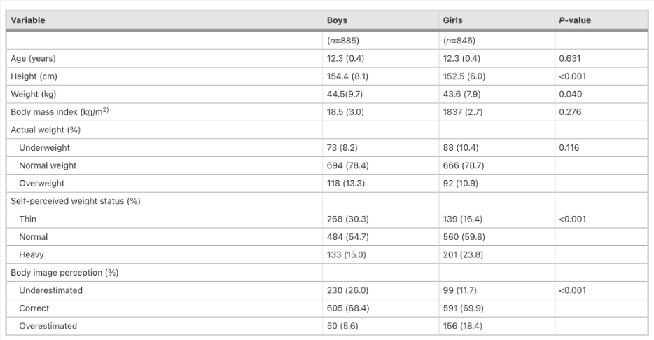
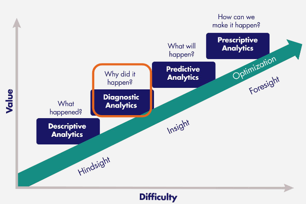
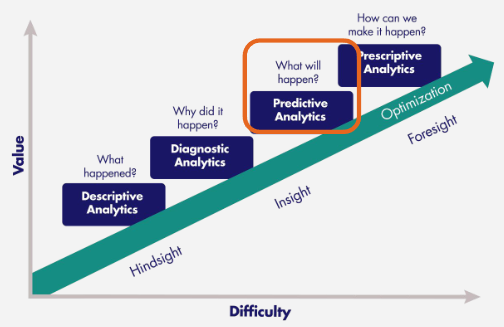
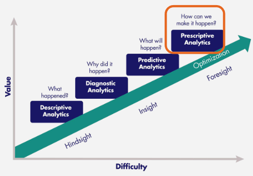

# INST452: Health Data Analytics

## Module 1: Introduction to R and Health Data Analytics

### What is analytics?

- The discovery of meaningful patterns in data.
- The synthesis of knowledge from information.
- **Source:** National Institute of Standards and Technology 2013

### Types of Analytics: Overview

- **Descriptive:** Uses business intelligence and data mining to ask: “What has happened?”
- **Diagnostic:** Examines data to answer “Why did it happen?”
- **Predictive:** Uses statistical models and forecasts to ask: “What could happen?”
- **Prescriptive:** Uses optimization and simulation to ask: “What should we do?”

#### Descriptive Analytics

- Describe the data using common statistics such as Measures of Central Tendency, Measures of Spread, and Frequency Distributions.
- Typical reporting methods include Tables, Charts, and Written narratives.
- _Example:_ Study population characteristics from a paper on the relationship between distorted body image and lifestyle in adolescents in Japan 2005-2009.

#### Diagnostic Analytics

- Attempts to answer “why did it happen?” using Drill-down techniques, Data discovery, and Correlations.

#### Predictive Analytics

- Predicts instead of describing or classifying.
- Emphasizes rapid analysis, relevant insights, and ease of use.

### What Predictive Analytics Cannot Do

- Predictive analytics cannot tell you what will happen in the future but can forecast what might happen, being probabilistic in nature.

#### Prescriptive Analytics

- Examines data to answer “What should be done?” and focuses on finding the best course of action, utilizing Graph analysis, Simulation, Complex event processing, Neural networks, Recommendation engines, Heuristics, and Machine learning.

## Introduction to R

### Why use R for analytics?

- It's a free, open-source, powerful, and highly extensible tool that can implement many common statistical procedures, provides excellent graphics functionality, and is a convenient starting point for data analysis projects.

#### R Script

- A program containing a series of commands executable one at a time or all at once, similar to a Python script in an IDE like Spyder.

#### R Markdown

- Written in markdown with embedded R code chunks, similar to a Jupyter Notebook, allowing narrative text and code in the same document.

#### R Help Resources

- Instructor, Google, StackOverflow, StackExchange, Reddit, and Quora.

#### Installing R/R Studio

- Available at [https://posit.co/products/open-source/rstudio](https://posit.co/products/open-source/rstudio)